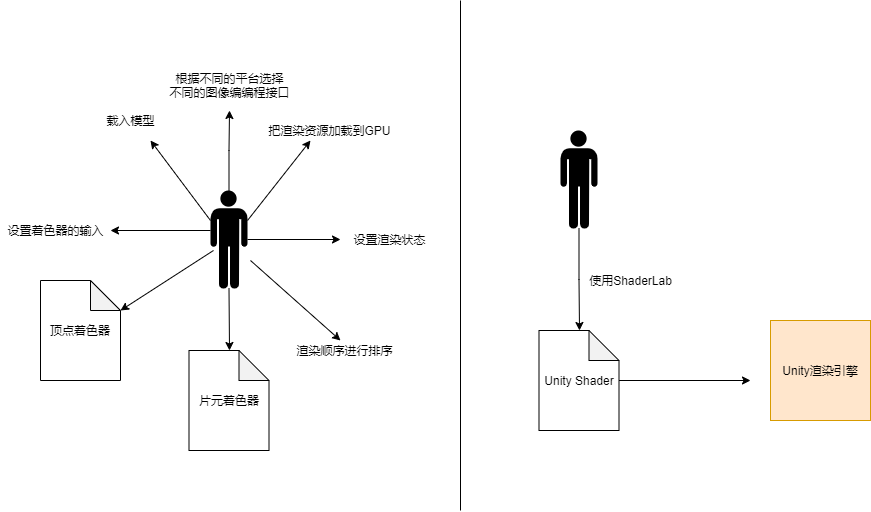
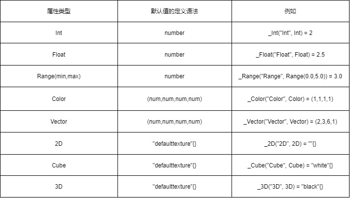

## 2.1 概述


**材质和Unity shader**

这俩人可是一对儿好基友，在 Unity 中需要配合使用材质( Material )和 Unity Shader 才能达到需要的效果，最常见的流程是：

1. 创建一个材质；
2. 创建一个 Unity Shader，并把它赋给上一步中创建的材质；
3. 把材质赋给要渲染的对象；
4. 在材质面板中调整 Unity Shader 的属性，以得到满意的效果；

Unity shader 中定义了渲染所需的各种代码( 如：顶点着色器和片元着色器 )、属性（纹理等）和指令（渲染和标签设置）而材质允许我们调节这些属性，比最终赋值给对应的模型。

创建材质的步骤：在Unity菜单栏选择 Assets --> Create --> Material 来创建，也可以直接在 Project 视图中右击-->Create --> Material 来创建。

在 Unity 5.2 及以上版本中，提供了四种 Unity 模板供我们选择：

* `Standard Surface Shader`：提供了一个标准光照模型的表面着色器模板。
* `Unlit Shader`：不包含光照（但包含雾效）的基本顶点/片元着色器；
* `Image Effect Shader`则为我们实现各种屏幕后处理效果提供了一个基本模板；
* `Compute Shader`会产生一种特殊的 Shader 文件，利用CPU并行性来进行一些与常规渲染流水线无关的计算。


## 2.2 ShaderLab

Shader Lab 是Unity 为开发者提供的高层级的渲染抽象层。可以使开发者更方便的控制渲染，而不用和很多文件和设置打交道，如下图所示：



在 Unity 中所有的 Unity Shader 都是使用 ShaderLab 来编写的。ShaderLab 是编写 Unity Shader 的一种说明性语言。一个 ShaderLab 的基础结构如下：

```shader
Shader "shaderName"{
    Properties {
        // 属性 ... ...
        // 属性 ... ...
    }
    SubShader{
        // 显卡 A 使用的子着色器
    }
    SubShader{
        // 显卡B 使用的子着色器
    }
    Fallback "VertexLit"
}
```
第一行用来指定一个 Shader 的名字，这个名字是一个字符串。通过在字符串中增加斜杠`/`，就可以控制Unity Shader 在材质面板中出现的位置。例如：

```shader
Shader "Custome/MyShader" { ... ...}
```
> 那么这个 Unity Shader 在材质面板中的位置就是：Shader --> Custom --> MyShader 

Propeties 关键字指定了一系列的属性，这些属性将会出现在材质面板中。

```shader
Properties {
    Name ("display name", Type) = DefaultValue
    Name ("display name", Type) = DefaultValue
    // ... ...
}
```

* `Name`：每个属性的名字，使用下划线开头`_`
* `display name`：显示的名称（display name）则是出现在材质面板上的名字。
* `Type`：类型
* `DefaultValue`：默认值

常见的属性类型如下表所示：



对于 **Int、Float、Range**这类数字类型的属性，其默认值是一个数字或一个值范围。

对于**Color、Vector**这类属性，默认值是圆括号包裹的一个思维向量；

对于**2D、Cube、3D**这类纹理类型，是通过一个字符串后跟一个花括号来指定的。其中字符串要么是空的，要么是内置的纹理名称如：`white、black、gray、bump`

>  Preperties 语义块的作用仅仅是为了让这些属性可以出现在材质面板中。